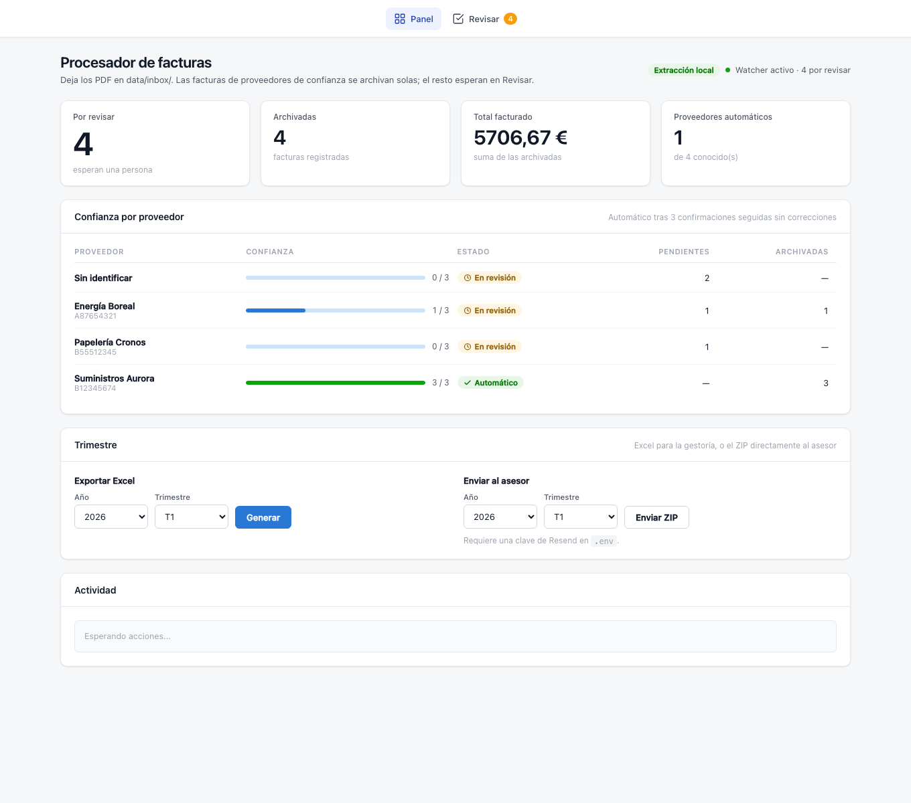

# docu-ai-flow

Folder-watching .NET 10 service that extracts invoice data from PDFs, exports to Excel, and emails quarterly archives to your advisor.

Drop a PDF into `./data/inbox/`. The service detects it, extracts the invoice fields, and either files it or **holds it for review** depending on how much that supplier has earned the benefit of the doubt. Confirmed invoices are persisted in SQLite, archived, and rolled into a master Excel spreadsheet. When a quarter closes, one command ZIPs the PDFs and emails them to your tax advisor via [Resend](https://resend.com).

Built with **.NET 10**, **C#**, and a strict **hexagonal architecture**. Business errors use the **Result pattern** (`SharpMonads.Core`); infrastructure failures bubble up to Polly.

**It runs with no accounts and no API keys.** One command, no clone required:

```bash
docker run --rm -v "$PWD/data:/app/data" ghcr.io/aitorevi/docu-ai-flow:latest make-samples /app/data/inbox
docker run --rm -p 8080:8080 -v "$PWD/data:/app/data" ghcr.io/aitorevi/docu-ai-flow:latest
```

Then open **http://localhost:8080**. The first command writes eight fictional invoices into the inbox; the second starts the watcher, extracts what it can, and parks the rest at **`/review`** with the PDF beside the form.



Three of those invoices come from the same supplier on purpose. Confirm all three without changing anything and you watch that supplier cross from **En revisión** to **Automático** — after which its invoices are filed without anyone looking at them. That is the whole idea of the project, and it takes about a minute to see.

Two ideas carry the project: [pluggable extraction](#pluggable-extraction) behind a single port, and a [human in the loop](#human-in-the-loop) whose corrections decide which suppliers get to skip review.

### Pluggable extraction

Extraction sits behind a single port, `IInvoiceDataExtractor`. Two adapters are live, and which one is bound is a **configuration** value (`Extraction:Provider`), not a code change:

- **Local templates** (`TemplateInvoiceExtractor`) — **the default**. Reads the PDF's text layer with [PdfPig](https://github.com/UglyToad/PdfPig), identifies the supplier from anchor strings, and pulls each field with an anchor + regex defined in `appsettings.json`. No network, no credentials, **0 € per invoice**.
- **Google Document AI** (`GoogleDocumentAiExtractor`) — the cloud Invoice Parser. Generalises to layouts nobody has ever taught it, at roughly $0.10 per page and a service-account key.

This project started on LlamaParse, moved to Google Document AI when its field accuracy fell short, and ended up on a local template extractor that beat both on the invoices it actually sees. Across all three swaps, **the domain, the use cases and the pipeline tests never changed** — they depend on the port, not on the provider. That is the whole return on the hexagon, and it is why the default is now the free one.

The trade-off is honest: templates only know the suppliers they have been taught. When no template matches, the extractor says so (`RequiresManualEntry`) instead of inventing an invoice.

#### OCR fallback

Scans have no text layer, so there is nothing for PdfPig to read. When `TemplateExtractor:OcrFallback:Enabled` is on, `TesseractOcrExtractor` rasterises the first page with poppler and reads it with Tesseract; the recovered text then goes through the same template pipeline. When it is off, a `NullOcrTextExtractor` returns an empty string, so no branch in the extractor has to know whether OCR exists. Any OCR failure — tools missing, timeout, corrupt PDF — degrades to manual entry rather than to an exception.

#### Writing a template

Three commands, no Worker required:

```bash
dotnet run --project src/InvoiceProcessor.Worker -- dump-text invoice.pdf
dotnet run --project src/InvoiceProcessor.Worker -- template-check ./data/samples
dotnet run --project src/InvoiceProcessor.Worker -- make-samples          # regenerate the demo PDFs
```

`template-check` reports one line per PDF and a success ratio:

```
[OK]     aurora-A-2026-0148.pdf — Suministros Aurora S.L.
[NONE]   desconocido-TD-2026-77.pdf — no template matched
[SCAN]   escaneo-sin-texto.pdf — no text layer (0 chars)

Result: 3/5 coherent (60%)  ·  0 incoherent [BAD]
```

It does not stop at "every required field was captured" — it cross-checks `net + tax = total`, so `[OK]` means the numbers are sane rather than merely present. A greedy pattern that grabs a phone number as the tax amount shows up as `[BAD]`.

## Stack

| Layer | Technology |
|---|---|
| Runtime | .NET 10 (ASP.NET Core + Worker Service) |
| Architecture | Hexagonal (ports & adapters) |
| Error handling | `Result<TValue, TError>` via SharpMonads.Core |
| Persistence | SQLite (`Microsoft.Data.Sqlite`) |
| Excel output | ClosedXML |
| Extraction | Local templates over PdfPig (default); Google Document AI (Invoice Parser) |
| OCR fallback | poppler (`pdftoppm`) + Tesseract, optional |
| Email | Resend REST API |
| Resilience | Polly (`AddStandardResilienceHandler`) |
| Tests | xUnit + NSubstitute + WireMock.Net + NetArchTest |

## Requirements

Only the first one is mandatory. Everything else buys an optional capability.

- [.NET 10 SDK](https://dotnet.microsoft.com/download)
- **Only** for `Extraction:Provider=DocumentAi`: a [Google Cloud](https://cloud.google.com/document-ai) project with a Document AI **Invoice Parser** processor and a service-account JSON key. The default local extractor needs neither.
- **Only** for the OCR fallback on scanned invoices: `poppler` and `tesseract`.
  macOS `brew install poppler tesseract tesseract-lang` · Debian/Ubuntu `apt-get install poppler-utils tesseract-ocr tesseract-ocr-spa`
- **Only** for email dispatch: a [Resend](https://resend.com) account and a verified domain
- **Only** to change the UI: [Node.js](https://nodejs.org). The built site is committed, so running the app never needs it.
- [Claude Code](https://claude.ai/code) (optional, for AI-assisted development)
- [gh](https://cli.github.com) (optional, for PR management)

## Setup

### Docker (recommended — identical on macOS, Windows and Linux)

Needs a Docker engine with `docker compose`: OrbStack or Docker Desktop on macOS, Docker Desktop or Docker Engine under WSL2 on Windows.

```bash
git clone https://github.com/aitorevi/docu-ai-flow
cd docu-ai-flow
docker compose run --rm app make-samples /app/data/inbox   # optional: the demo invoices
docker compose up -d
open http://localhost:8080
```

That is the whole setup. No `.env`, no accounts, no .NET or Node on the machine.

| | |
|---|---|
| Port | `8080`. Not 5000 — on macOS that port belongs to the AirPlay receiver |
| Data | `./data` on the host is `/app/data` in the container: same layout on both sides, and the SQLite database survives the container |
| Elsewhere | Point `DATA_DIR` at another folder in `.env` |
| Update | `docker compose pull && docker compose up -d` |
| Logs / stop | `docker compose logs -f` · `docker compose down` |
| Config | Add a `.env` only to switch to Document AI, enable OCR, or send email — see [Configuration](#configuration). Without one the app uses the local extractor |

The image ships poppler and Tesseract, so enabling the OCR fallback is a config flag rather than a rebuild.

### Windows, without Docker (recommended path: `C:\docu-ai-flow`)

Clone to a path without spaces, then run the setup script once:

```
git clone https://github.com/aitorevi/docu-ai-flow C:\docu-ai-flow
cd C:\docu-ai-flow
git config core.hooksPath .githooks
```

Right-click `setup.ps1` → **Run with PowerShell**. It will:
- Verify that .NET 10 SDK is installed (shows the download link if missing)
- Create the `data\inbox`, `data\pending`, `data\archive`, `data\duplicates`, `data\failed`, `data\output` folders
- Copy `.env.example` → `.env`

The `.env` is optional — without it the app uses the local extractor. See [Configuration](#configuration). Double-click **`run.bat`** to start.

To update the app later: double-click **`update.bat`** (runs `git pull`), then `run.bat` again.

### macOS / Linux, without Docker

```bash
git clone https://github.com/aitorevi/docu-ai-flow
cd docu-ai-flow
git config core.hooksPath .githooks
dotnet restore
dotnet run --project src/InvoiceProcessor.Worker
```

`.env` is optional — copy `.env.example` only if you want Document AI, OCR or email.

## Usage

### Web dashboard (default mode)

Starting the app opens a browser — `http://localhost:8080` under Docker, `http://localhost:5000` when run directly — with a panel for exporting and sending, and **`/review`** for the invoices waiting on a human.

```bash
# Windows: double-click run.bat
# macOS/Linux:
dotnet run --project src/InvoiceProcessor.Worker
```

Stop with **Ctrl+C**. If the port is already in use (e.g. a previous run crashed), free it first:

```bash
lsof -ti :5000 | xargs kill -9
```

### Try it with no configuration at all

```bash
cp data/samples/*.pdf data/inbox/          # running directly
docker compose run --rm app make-samples /app/data/inbox   # under Docker
```

Eight fictional invoices, chosen to walk every interesting path:

| File | What it exercises |
|---|---|
| `aurora-A-2026-*.pdf` (×3) | `label: value` layout, Spanish numbers and dates. **Three from one supplier**, so confirming them all walks it to *Automático* |
| `boreal-FR-2026-*.pdf` (×2) | column table: the values sit on the line after the header |
| `cronos-C-26-0311.pdf` | dot leaders, US numbers, English month |
| `desconocido-TD-2026-77.pdf` | no template for this supplier → manual entry, not a guess |
| `escaneo-sin-texto.pdf` | no text layer → OCR fallback, or manual entry when OCR is off |

Regenerate them any time with `dotnet run --project src/InvoiceProcessor.Worker -- make-samples`. `ShippedDemoTemplatesTests` runs every one of them through the shipped templates, so a broken sample fails the build rather than the demo.

### The pipeline

Drop PDF invoices into `./data/inbox/`. The watcher will:
1. Detect the file (real-time watcher + polling fallback)
2. Wait until the file is fully written
3. Check for duplicates — by content hash, and by natural key (invoice number + supplier tax id)
4. Extract invoice fields with the active extractor (local templates by default)
5. Normalize the supplier against the catalog in `appsettings.json`
6. **Hold it for review, unless the supplier has earned trust** — see below
7. Persist the invoice in SQLite (`./data/invoices.db`)
8. Archive the PDF to `./data/archive/{year}/{month}/{supplier}/`
9. Regenerate `./data/output/maestro_facturas.xlsx`

From the dashboard you can:
- **Export Excel** — generate the quarterly spreadsheet ready for your accounting app
- **Send to advisor** — ZIP and email the quarter's PDFs to your tax advisor (+ CC to yourself if configured)

### Human in the loop

Extraction is never 100% right. The interesting question is not whether a person reviews the results, but **which invoices earn the right to skip review** — and that is decided per supplier, by track record.

A supplier starts untrusted: every invoice of theirs waits in `data/pending/` and shows up at **`/review`**. After `Extraction:SupplierTrustThreshold` consecutive confirmations in which the reviewer changed *nothing*, the supplier is trusted and its invoices are filed automatically. **One correction resets the counter to zero and revokes the trust.** Autonomy is earned, per supplier, and can be lost.

`appsettings.json` ships **3** so the idea can be seen: at the real-world value of 20 someone trying the demo confirms an invoice, reads "1 de 20", and never witnesses a supplier become autonomous. Raise it to 20 when this is actually doing your books.

The review screen puts the PDF next to the form:

- Each field shows the confidence it was extracted with. Low confidence is amber, so the reviewer knows where to look first; a field the template never captured is greyed out and disabled rather than flagged as an error.
- Invoices recovered by OCR, and credit notes with negative amounts, carry a banner — both are worth a second look.
- **Confirm** files the invoice and updates the supplier's trust. **Reject** discards it to `failed/`. **Requeue** returns the PDF to the inbox so it is extracted again — the move you want after fixing a template, and the reason a bad template costs you nothing permanent.
- A document nobody could read at all (a scan, an unknown supplier) becomes a blank form to fill in by hand, with a `net + tax = total` check before it is accepted.

Extractions whose totals do not add up, or whose confidence is below `Extraction:ConfidenceThreshold`, never reach the queue: they go straight to `./data/failed/`.

### CLI modes

All operations are also available as one-shot CLI commands:

```bash
# Export quarterly Excel
dotnet run --project src/InvoiceProcessor.Worker -- export 2026 1
# Output: ./data/output/facturas_extraidas_2026Q1_{timestamp}.xlsx

# Send quarterly PDFs to advisor
dotnet run --project src/InvoiceProcessor.Worker -- send 2026 1

# Rebuild master spreadsheet from database
dotnet run --project src/InvoiceProcessor.Worker -- master
```

The fiscal quarter rule (Sistema 2) is applied: Q1 2026 covers 01-Oct-2025 → 31-Mar-2026. All commands are idempotent — re-running only processes what is new since the last run.

**Large ZIP handling:** if the quarter's ZIP would exceed `MailDispatch:MaxAttachmentMb` (default 38 MB), the app automatically splits by month and sends one email per part (`Invoices 2026-Q1 - Part 1/3 (January)`). No manual intervention needed.

## Project structure

```
docu-ai-flow.sln
Directory.Build.props          # net10.0, Nullable, TreatWarningsAsErrors, SharpMonads.Core
Dockerfile                     # astro build → dotnet publish → aspnet + poppler/tesseract
docker-compose.yml             # port 8080, ./data bind-mounted, optional .env
src/
├── InvoiceProcessor.Domain/          # Zero external dependencies
│   ├── Invoices/                     # Invoice, Money, Supplier, SupplierTrust, InvoiceLine, InvoiceId
│   ├── Documents/                    # IncomingDocument, DocumentContent, DocumentId
│   └── Dispatch/                     # Quarter (fiscal rules: ExcelSourceRange, ExcelQuarterFor)
├── InvoiceProcessor.Application/     # Use cases + port definitions
│   ├── Ports/Inbound/                # IProcessInvoiceUseCase, IReviewInvoiceUseCase, ISendQuarterToAdvisorUseCase, IExportQuarterToSpreadsheetUseCase
│   ├── Ports/Outbound/               # IInvoiceDataExtractor, IDocumentArchiver, IPendingInvoiceRepository, ISupplierTrustRepository, …
│   ├── Invoices/                     # ProcessInvoiceService, ReviewInvoiceService, PendingInvoice, ExtractionToInvoiceMapper
│   ├── Dispatch/                     # SendQuarterToAdvisorService
│   └── Export/                       # ExportQuarterToSpreadsheetService
├── InvoiceProcessor.Infrastructure/  # Concrete adapters
│   ├── Extraction/Templates/         # TemplateInvoiceExtractor, TemplateFieldParser, AppsettingsTemplateRepository (default)
│   ├── Extraction/DocumentAi/        # GoogleDocumentAiExtractor, GoogleDocumentAiMapper, GoogleDocumentAiOptions
│   ├── Extraction/Ocr/               # TesseractOcrExtractor, NullOcrTextExtractor (fallback for scans)
│   ├── Extraction/                   # SupplierNameHeuristics (shared)
│   ├── Files/                        # FileSystemDocumentReader, FileSystemDocumentArchiver, FileSystemArchivedInvoiceSource, FileStabilityWaiter
│   ├── Suppliers/                    # CatalogSupplierNormalizer, CompanyOptions
│   ├── Idempotency/                  # JsonFileProcessedDocumentLog
│   ├── Persistence/                  # SqliteProcessedInvoiceRepository, SqlitePendingInvoiceRepository, SqliteSupplierTrustRepository, …
│   ├── Export/                       # ClosedXmlMasterSpreadsheetWriter, ClosedXmlQuarterSpreadsheetExporter
│   ├── Dispatch/                     # ZipInvoiceArchiveCompressor
│   └── Mail/                         # ResendAdvisorMailSender
└── InvoiceProcessor.Worker/          # Composition root + web UI + CLI entry points
    ├── Program.cs                    # DI wiring, health, export/send endpoints, CLI modes
    ├── ReviewEndpoints.cs            # /api/pending: queue, detail, PDF, confirm / reject / requeue
    ├── TemplateDiagnostics.cs        # template-check and dump-text
    ├── SampleInvoices.cs             # the fictional demo invoices + make-samples
    ├── FolderWatcherService.cs       # BackgroundService: watcher + polling + concurrency gate
    └── wwwroot/                      # Astro build output, served at http://localhost:5000
tests/
├── InvoiceProcessor.Domain.Tests/          # Pure unit tests (Money, Invoice, Quarter)
├── InvoiceProcessor.Application.Tests/    # Use cases with NSubstitute port doubles
└── InvoiceProcessor.Integration.Tests/    # Archiver, SQLite repos, Excel writers, zip, watcher stress, mapper golden-master
    ├── Api/                                # Endpoint tests against the real host (WebApplicationFactory)
    ├── Fixtures/                           # MinimalPdf, SyntheticPdf, FakeInvoiceDataExtractor
    ├── Extraction/                         # template extractor + parser, shipped demo templates, Document AI mapper golden-master
    └── Pipeline/                           # End-to-end pipeline tests (Processing, Review, Export, Send)
frontend/                          # Astro 6 — builds straight into the Worker's wwwroot
├── src/pages/index.astro          # Panel: export + send
├── src/pages/review.astro         # Review screen: PDF beside the form
└── src/layouts, components, scripts, styles
data/
├── samples/     # Fictional invoices to try it with (committed)
├── inbox/       # Drop PDFs here
├── pending/     # Held for human review — see /review
├── archive/     # Filed PDFs (year/month/supplier/supplier-number.pdf)
├── duplicates/  # Already seen: same bytes, or same invoice number + tax id
├── failed/      # Rejected, or extractions that did not add up
└── output/      # Generated Excel files
```

### Rebuilding the frontend

The built site is committed under `src/InvoiceProcessor.Worker/wwwroot/`, so `dotnet run` works without Node. To change the UI:

```bash
cd frontend
npm install
npm run dev     # HMR at :4321, API proxied to the running Worker
npm run build   # rebuilds wwwroot
```

## Configuration

The recommended way to configure the app is via a `.env` file in the repo root (gitignored). Copy `.env.example` to get started:

```
# Extraction backend: Template (default, local, free) or DocumentAi (Google, paid).
# Leave it unset and you get Template.
Extraction__Provider=Template

# Only for Extraction__Provider=DocumentAi. Credentials are loaded from the
# service-account JSON pointed to by GOOGLE_APPLICATION_CREDENTIALS (ADC).
GOOGLE_APPLICATION_CREDENTIALS=/path/to/service-account.json
GoogleDocumentAi__ProjectId=your-gcp-project-id
GoogleDocumentAi__Location=eu
GoogleDocumentAi__ProcessorId=your-processor-id

# Only for scanned invoices; requires poppler + tesseract on the machine.
TemplateExtractor__OcrFallback__Enabled=false

# Your own company identity — used to filter the buyer out of the extracted supplier fields.
Company__TaxId=
Company__Name=

Resend__ApiKey=re_your-key-here
Resend__FromAddress=invoices@yourdomain.com
Resend__AdvisorAddress=advisor@accounting.com
# Optional: receive a copy of every email sent to the advisor
Resend__CcAddress=you@email.com
```

The double-underscore maps to JSON section separators (`Resend__ApiKey` → `Resend:ApiKey`). On macOS/Linux you can also use `dotnet user-secrets` instead. The Google service-account key is never read from config — only the path in `GOOGLE_APPLICATION_CREDENTIALS`.

All non-secret settings live in `src/InvoiceProcessor.Worker/appsettings.json`:

```json
{
  "Folders": {
    "Inbox": "./data/inbox",
    "Archive": "./data/archive",
    "Failed": "./data/failed",
    "Output": "./data/output",
    "MaxConcurrency": 3,
    "PollSeconds": 5
  },
  "GoogleDocumentAi": {
    "ProjectId": "",
    "Location": "eu",
    "ProcessorId": ""
  },
  "Company": {
    "TaxId": "",
    "Name": ""
  },
  "Extraction": {
    "Provider": "Template",
    "ConfidenceThreshold": 0.6,
    "SupplierTrustThreshold": 3
  },
  "TemplateExtractor": {
    "MinTextLength": 50,
    "OcrFallback": { "Enabled": false, "Language": "spa", "TimeoutSeconds": 60 },
    "Templates": [
      {
        "SupplierId": "aurora",
        "SupplierName": "Suministros Aurora S.L.",
        "SupplierTaxId": "B12345674",
        "IdentificationAnchors": ["SUMINISTROS AURORA", "B12345674"],
        "Fields": {
          "invoice_number": { "Anchors": ["Factura Nº"], "Pattern": ":\\s*(\\S+)" },
          "issue_date":     { "Anchors": ["Fecha"], "Pattern": ":\\s*([\\d/]+)" },
          "net_amount":     { "Anchors": ["Base imponible"], "Pattern": ":\\s*([\\d.,]+)" }
        }
      }
    ]
  },
  "SupplierCatalog": {
    "Suppliers": [
      { "CanonicalName": "Suministros Aurora", "TaxId": "B12345674", "Aliases": ["SUMINISTROS AURORA S.L."] }
    ]
  },
  "Resend": {
    "ApiKey": "",
    "FromName": "Invoice Processor",
    "FromAddress": "invoices@yourdomain.com",
    "AdvisorAddress": "advisor@accounting.com",
    "CcAddress": "",
    "MaxAttachmentMb": 38
  },
  "MailDispatch": {
    "MaxAttachmentMb": 38
  },
  "Database": {
    "Path": "./data/invoices.db"
  }
}
```

| Key | Description |
|-----|-------------|
| `Extraction:Provider` | `Template` (default, local, free) or `DocumentAi` (Google, paid). An unrecognised value falls back to `Template` |
| `TemplateExtractor:Templates` | Per-supplier anchors and regexes. `IdentificationAnchors` pick the supplier; each field has its own `Anchors` + `Pattern` whose first capture group is the value |
| `TemplateExtractor:MinTextLength` | Below this many characters the PDF is treated as a scan |
| `TemplateExtractor:OcrFallback:Enabled` | Rasterise scans with poppler and read them with Tesseract. Off by default |
| `GoogleDocumentAi:Location` | Document AI region; must match the processor's location (e.g. `eu`, `us`) |
| `GoogleDocumentAi:ProcessorId` | The Invoice Parser processor id from the Google Cloud console |
| `Company:TaxId` / `Company:Name` | Your own identity — filtered out of the extracted supplier fields |
| `Resend:FromAddress` | Must belong to a domain verified in Resend (DKIM/SPF) |
| `Resend:CcAddress` | Optional. When set, a copy of every advisor email is sent here |
| `Extraction:ConfidenceThreshold` | Extractions with lower average confidence are moved to `failed/` |
| `Extraction:SupplierTrustThreshold` | Consecutive corrections-free confirmations before a supplier's invoices are filed without review. Ships as `3` so the demo is watchable; use `20` for real use |
| `MailDispatch:MaxAttachmentMb` | ZIP size limit before splitting by month (default 38 MB — Resend's hard limit is 40 MB) |

## Running tests

```bash
dotnet test                                  # all 250 tests
dotnet test --filter "Category!=LiveGcp&Category!=RequiresTesseract"   # CI default
dotnet test --filter "Domain"                # domain unit tests only
dotnet test --filter "Application"           # use-case unit tests only
dotnet test --filter "Integration"           # integration tests (SQLite, Excel, zip, watcher, pipeline, mappers)
dotnet test --filter "Pipeline"              # end-to-end pipeline tests only
```

Two tests are excluded from CI. `GoogleDocumentAiExtractorLiveTests` (`Category=LiveGcp`) calls the real Google API and self-skips unless the credentials and processor env vars are present. `TesseractOcrExtractorIntegrationTests` (`Category=RequiresTesseract`) shells out to the real poppler + tesseract binaries.

`ShippedDemoTemplatesTests` runs the demo templates from the Worker's own `appsettings.json` against generated PDFs, so a broken anchor or pattern fails the build rather than someone's first run.

### Test layers

| Layer | Count | What they cover |
|---|---|---|
| Domain | 28 | `Money`, `Invoice`, `Quarter`, `SupplierTrust` — pure business rules, no dependencies |
| Application | 45 | Use cases with NSubstitute port doubles — processing, review, trust, export, send |
| Integration | 177 | Real SQLite, ClosedXML, filesystem, zip, PdfPig; template extraction and the shipped demo templates; the API through `WebApplicationFactory`; WireMock stub for Resend |

The **Pipeline** tests (inside Integration) are the most comprehensive: they wire the full DI graph (`AddApplication + AddInfrastructure`) against temporary directories and a temporary SQLite database. Extraction is driven through the `IInvoiceDataExtractor` port via an in-memory `FakeInvoiceDataExtractor` (no HTTP, no provider coupling); a WireMock server stubs only Resend. They exercise the entire system end-to-end:

- **Processing** — happy path (PDF → extraction → DB → archive), duplicate detection, low-confidence rejection (moved to `failed/`), quarter assignment, multiple invoices from the same supplier
- **Export** — Excel generation, idempotency (re-running only exports what is new), master spreadsheet rebuild
- **Send** — ZIP creation, correct email recipient, sent log, idempotency, pending-only selection (previously sent PDFs are excluded)

No real API keys or network access are needed to run any test.

## Architecture

```
Worker ──► Infrastructure ──► Application ──► Domain
```

- **Domain** has zero external dependencies. All business rules live here.
- **Application** defines the ports (interfaces) and implements the use cases against them. It only depends on Domain.
- **Infrastructure** implements the ports using real technology (SQLite, ClosedXML, HttpClient, FileSystem). It depends on Application and Domain.
- **Worker** is the composition root. It wires everything together and is the only place where concrete adapters are chosen.

Architecture tests (NetArchTest) enforce these boundaries on every build.

## Development workflow

Every task starts with the orchestrator agent:

```
@orchestrator <describe the task>
```

The orchestrator explores, debates, plans, implements (TDD), reviews and validates. Plans live in `workflow/` and move through `plans/ → in-progress/ → reviewing/ → done/`.

Commit convention: `type(scope): short description in imperative English`

Types: `feat`, `fix`, `chore`, `docs`, `refactor`, `test`

## License

MIT © [Aitor Reviriego Amor](https://github.com/aitorevi)

See [LICENSE](LICENSE) for the full text.
