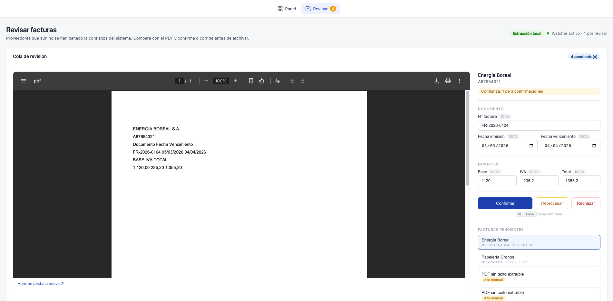

# How it works

What happens between dropping a PDF in the inbox and the invoice being filed — and the rule
that decides whether a person sees it first.

## The pipeline

Drop PDF invoices into `./data/inbox/`. The watcher will:
1. Detect the file (real-time watcher + polling fallback)
2. Wait until the file is fully written
3. Check for duplicates — by content hash, and by natural key (invoice number + supplier tax id)
4. Extract invoice fields with the active extractor (local templates by default)
5. Normalize the supplier against the catalog in `appsettings.json`
6. **Hold it for review, unless the supplier has earned trust** — see below
7. Persist the invoice in SQLite (`./data/invoices.db`)
8. Archive the PDF to `./data/archive/{year}/{month}/{supplier}/`
9. Regenerate `./data/output/maestro_facturas.xlsx`

From the dashboard you can:
- **Export Excel** — generate the quarterly spreadsheet ready for your accounting app
- **Send to advisor** — ZIP and email the quarter's PDFs to your tax advisor (+ CC to yourself if configured)

## Human in the loop

Extraction is never 100% right. The interesting question is not whether a person reviews the results, but **which invoices earn the right to skip review** — and that is decided per supplier, by track record.

A supplier starts untrusted: every invoice of theirs waits in `data/pending/` and shows up at **`/review`**. After `Extraction:SupplierTrustThreshold` consecutive confirmations in which the reviewer changed *nothing*, the supplier is trusted and its invoices are filed automatically. **One correction resets the counter to zero and revokes the trust.** Autonomy is earned, per supplier, and can be lost.

`appsettings.json` ships **3** so the idea can be seen: at the real-world value of 20 someone trying the demo confirms an invoice, reads "1 de 20", and never witnesses a supplier become autonomous. Raise it to 20 when this is actually doing your books.

The review screen puts the PDF next to the form:

- Each field shows the confidence it was extracted with. Low confidence is amber, so the reviewer knows where to look first; a field the template never captured is greyed out and disabled rather than flagged as an error.
- Invoices recovered by OCR, and credit notes with negative amounts, carry a banner — both are worth a second look.
- **Confirm** files the invoice and updates the supplier's trust. **Reject** discards it to `failed/`. **Requeue** returns the PDF to the inbox so it is extracted again — the move you want after fixing a template, and the reason a bad template costs you nothing permanent.
- A document nobody could read at all (a scan, an unknown supplier) becomes a blank form to fill in by hand, with a `net + tax = total` check before it is accepted.

Extractions whose totals do not add up, or whose confidence is below `Extraction:ConfidenceThreshold`, never reach the queue: they go straight to `./data/failed/`.
